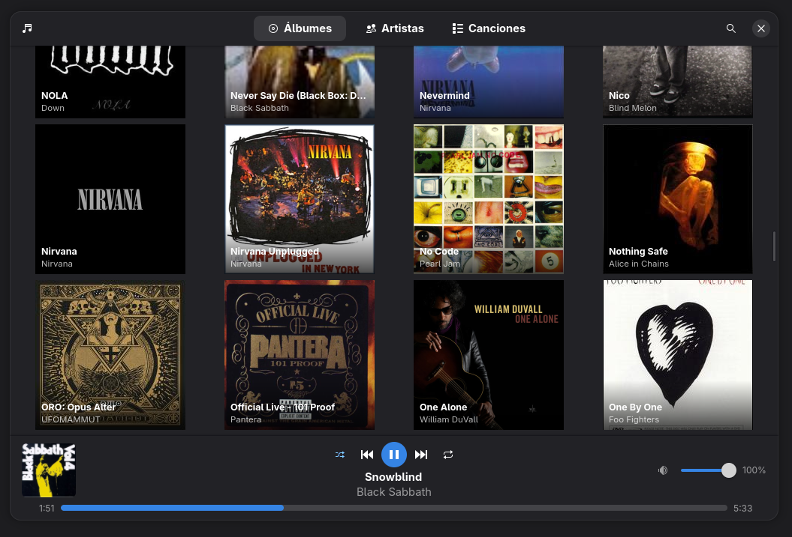

[](https://github.com/amurpo/audra/actions/workflows/release.yml)
# Audra

Native music player for Linux, built with GTK4 and libadwaita.

## Screenshot



> Preliminary design — not the final design, subject to change.

## Features

- Music library with albums, artists and songs views
- Hierarchical navigation: artist → album → songs
- MP3, FLAC, OGG and WAV support
- Automatic scrobbling to [Last.fm](https://www.last.fm) with OAuth authentication
- Shuffle with fixed random order (each song plays once)
- Track repeat
- Artist art and album covers downloaded automatically
- Native interface following GNOME design guidelines

## Requirements

Runtime: GTK4, libadwaita, ALSA.

Build from source additionally needs a Rust toolchain and **gettext**
(`msgfmt`, used to compile the translation catalog — the build fails
loudly if it is missing).

### Build dependencies

Fedora / RHEL:

```bash
sudo dnf install \
  gcc pkg-config \
  gtk4-devel libadwaita-devel \
  alsa-lib-devel fontconfig-devel \
  gettext
```

Debian / Ubuntu:

```bash
sudo apt install \
  build-essential pkg-config \
  libgtk-4-dev libadwaita-1-dev \
  libgdk-pixbuf-2.0-dev libasound2-dev \
  gettext
```

## Installation

### RPM (Fedora / RHEL)

```bash
sudo dnf install audra-*.rpm
```

### From source

```bash
cargo build --release
```

The binary will be at `target/release/audra`.

To build with Last.fm integration, export the proxy URL before building:

```bash
export LASTFM_PROXY_URL=https://your-proxy.example.com/lastfm
cargo build --release
```

Last.fm authentication uses the standard OAuth flow: the user authorizes on the official Last.fm
site and never enters credentials in the app. The proxy (Cloudflare Workers) signs requests
server-side — the binary only contains the public proxy URL.

## Building the RPM

```bash
bash packaging/build-rpm.sh
```

## License

GPL-3.0-or-later — see [LICENSE](LICENSE).
