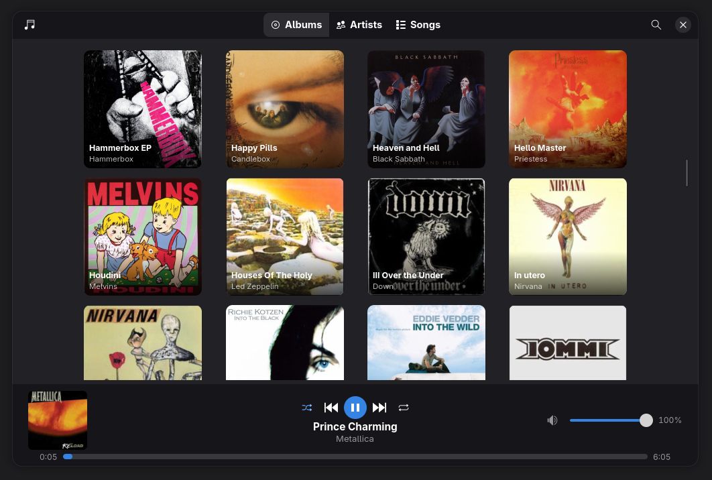
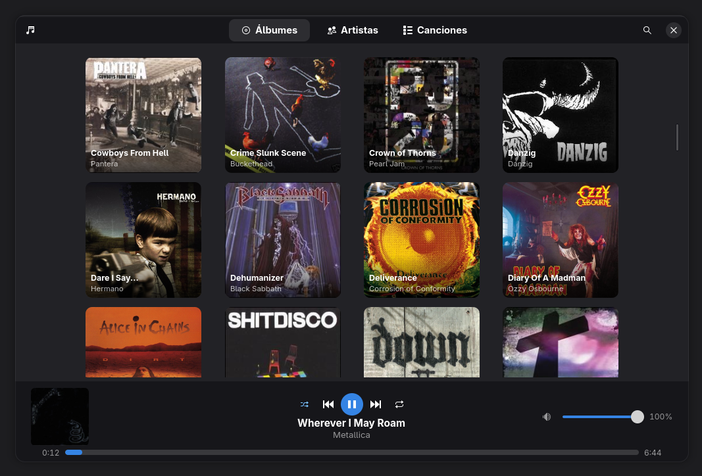

[](https://github.com/amurpo/audra/actions/workflows/release.yml) [](https://github.com/amurpo/audra/actions/workflows/nightly.yml)
# Audra

Native music player for Linux, built with GTK4 and libadwaita.

## Screenshots




## Features

- Music library with albums, artists and songs views
- Hierarchical navigation: artist → album → songs
- MP3, FLAC, OGG and WAV support
- Shuffle with fixed random order (each song plays once) and track repeat
- ReplayGain volume normalization (track and album modes)
- Now-playing highlight with a per-row play/pause control in every track list
- Dynamic background tinted from the album cover, with Off / Partial / Full modes (adapted from Amberol)
- MPRIS2 media controls on Linux (play/pause/skip from the desktop shell, lock screen, etc.)
- Automatic scrobbling and now-playing updates to [Last.fm](https://www.last.fm) with OAuth authentication
- Artist art and album covers downloaded automatically; right-click any album or artist to pick a custom image or search for one
- Automatic album and artist grouping that handles inconsistent tags — accent normalization is still partial
- Native interface following GNOME design guidelines

## Performance

Audra is built to stay light, and the claim is measured rather than asserted.
Its memory footprint is small and leak-free — bounded by library size, not by
uptime — it spends almost no CPU during playback, and it renders through GTK4's
Vulkan backend so scrolling and the dynamic gradient background stay smooth on
the GPU without loading the CPU.

### Known trade-off and planned work

- Both main grids — albums and artists — use a virtualized `GtkGridView`: only
  the cards on screen are realized, so opening the library is instant with no
  layout hitch, even for large collections. The only remaining `GtkFlowBox` is
  the small album sub-grid inside an artist's detail page, which is deliberate: a
  single artist never has thousands of albums, so there is no scrolling hitch to
  virtualize away there.
- Decoding uses a tolerant Symphonia-based pipeline that recovers from malformed
  MP3 frames other players reject. A GStreamer backend is under consideration if
  more codec edge-cases surface.

The measured numbers — memory, CPU, frame timings — the test rig, and how to
reproduce them are tracked in
[docs/PERFORMANCE_HISTORY.md](docs/PERFORMANCE_HISTORY.md).

## Requirements

Runtime: GTK4, libadwaita, ALSA.

Build from source additionally needs a Rust toolchain and **gettext**
(`msgfmt`, used to compile the translation catalog — the build fails
loudly if it is missing).

### Build dependencies

Fedora / RHEL:

```bash
sudo dnf install \
  gcc pkg-config \
  gtk4-devel libadwaita-devel \
  alsa-lib-devel fontconfig-devel \
  gettext
```

Debian / Ubuntu:

```bash
sudo apt install \
  build-essential pkg-config \
  libgtk-4-dev libadwaita-1-dev \
  libgdk-pixbuf-2.0-dev libasound2-dev \
  gettext
```

macOS (Apple Silicon, Homebrew):

```bash
brew install gtk4 libadwaita gettext pkg-config
export PKG_CONFIG_PATH="/opt/homebrew/lib/pkgconfig:/opt/homebrew/share/pkgconfig"
```

See [docs/BUILD-macos-arm64.md](docs/BUILD-macos-arm64.md) for the full macOS arm64 build, run, and verify steps.

## Tested on

Audra is regularly built and run on the setups below. Any GTK4-capable desktop
should work; these are simply the combinations that have been verified.

| Distribution | Desktop(s) | Install | Notes |
| --- | --- | --- | --- |
| Debian 13 (Trixie) | GNOME, KDE Plasma, Xfce, LXDE | `.deb` | On LXDE the window has square corners — Openbox runs no compositor, so the client-side rounded corners aren't drawn |
| Linux Mint 22.3 | Cinnamon | `.deb` | |
| Ubuntu 26.04 | GNOME | `.deb` | |
| Fedora 44 Workstation | GNOME | source / `.rpm` | primary development platform |
| Manjaro 26.0.4| GNOME | source | built without `LASTFM_PROXY_URL`, so the Last.fm features are disabled |

Other desktops on these distributions (e.g. KDE Plasma on Fedora) are expected
to work but haven't all been individually checked.

## Installation

### RPM (Fedora / RHEL)

```bash
sudo dnf install audra-*.rpm
```

### DEB (Debian / Ubuntu)

```bash
sudo apt install ./audra_*_amd64.deb
```

### From source

```bash
cargo build --release
```

The binary will be at `target/release/audra`.

On macOS (arm64), use `bash packaging/build-macos.sh` and `bash packaging/verify-macos-build.sh` to build and test; run with `bash packaging/run-macos.sh` so Homebrew GTK libraries are found.

To build with Last.fm integration, export the proxy URL before building:

```bash
export LASTFM_PROXY_URL=https://your-proxy.example.com/lastfm
cargo build --release
```

### Why a proxy instead of embedding the API key?

Last.fm's API requires every request to be **signed** with an API secret — not just the login,
but also every scrobble and now-playing update. The signature is an MD5 hash over the request
parameters plus that secret. Embedding the secret in an open-source binary is equivalent to
publishing it: anyone can extract it with `strings audra` and use your app's quota.

The solution is a small BFF (Backend-for-Frontend) proxy that holds the secret server-side and
signs requests on behalf of the client. The binary only needs to know the proxy's public URL.
The user's **session key** (obtained after OAuth) is stored locally, which is safe: it
authenticates the user to Last.fm but cannot be used to sign arbitrary API calls without the
secret.

Authentication uses the standard Last.fm OAuth flow: the user approves the app on the official
Last.fm site and never types credentials into Audra.

## Uninstalling

Removing the package (`sudo dnf remove audra` / `sudo apt remove audra`) never
touches your personal data: package managers only delete files the package owns
under system paths, so your library, settings and cached covers are always kept
for a future reinstall.

To also wipe all per-user data, delete these directories manually:

```bash
rm -rf ~/.local/share/audra   # library database and downloaded covers
rm -rf ~/.cache/audra         # media-controls thumbnail cache
rm -rf ~/.config/audra        # bundled fonts and settings
```

On Windows the uninstaller asks whether to keep or delete this data, and the
installer reports whether it is repairing the same version or updating an
existing one.

## Building the RPM

```bash
bash packaging/build-rpm.sh
```

## Building the DEB

```bash
bash packaging/build-deb.sh
```

The package is written to `target/debpkg/audra_<version>_amd64.deb`.

## Building on macOS (Apple Silicon)

```bash
bash packaging/build-macos.sh
bash packaging/verify-macos-build.sh   # build + arm64 check + cargo test
bash packaging/run-macos.sh            # launch with Homebrew libs on the loader path
```

Details: [docs/BUILD-macos-arm64.md](docs/BUILD-macos-arm64.md).

## Credits

The dynamic, album-art-based background (stacked diagonal color gradients
extracted from the cover) is adapted from [Amberol](https://gitlab.gnome.org/World/amberol)
by Emmanuele Bassi, also licensed GPL-3.0-or-later. Thank you.

On macOS, UI icons are bundled from [Remix Icon](https://remixicon.com) as SVG
under `data/icons/remix/`; on Linux the system's symbolic icon theme is used
instead. See [licenses/REMIX-ICON.txt](licenses/REMIX-ICON.txt) and
[data/icons/remix/LICENSE](data/icons/remix/LICENSE) (Remix Icon License v1.0).

## License

GPL-3.0-or-later — see [LICENSE](LICENSE).
